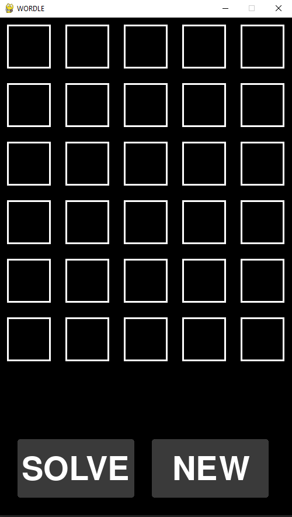
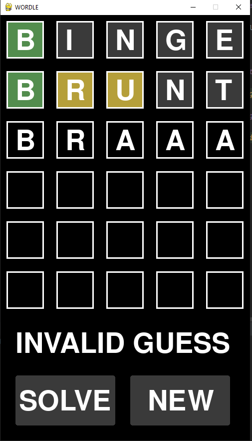
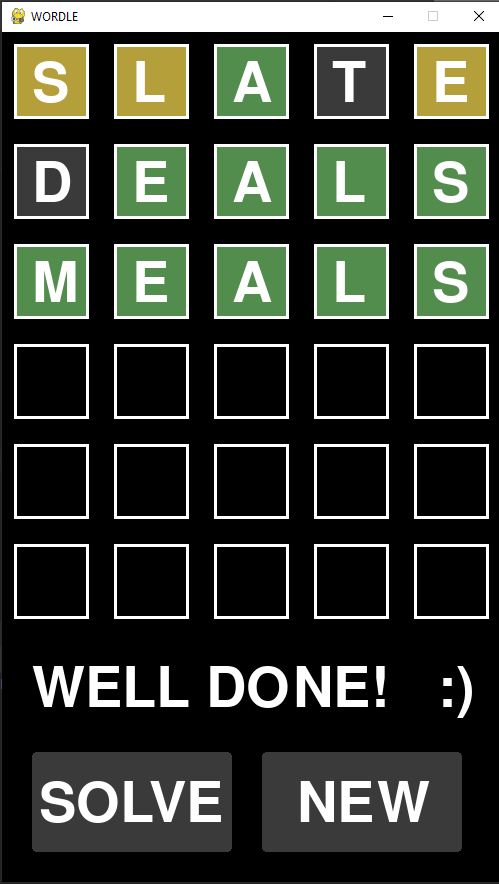

# Wordle Clone & Solver

Developed a clone of the popular New York Times game Wordle (https://www.nytimes.com/games/wordle) with an accompanying solving algorithm.

Written using python and the pygame library to provide the graphical user interface.

# Initial State

# Game in Progress

# Completed using "SOLVE" button

# Solving Algorithm

Designed a simple elimination based algorithm that reduces the number of valid guesses based on the correctness of the previous guess.
